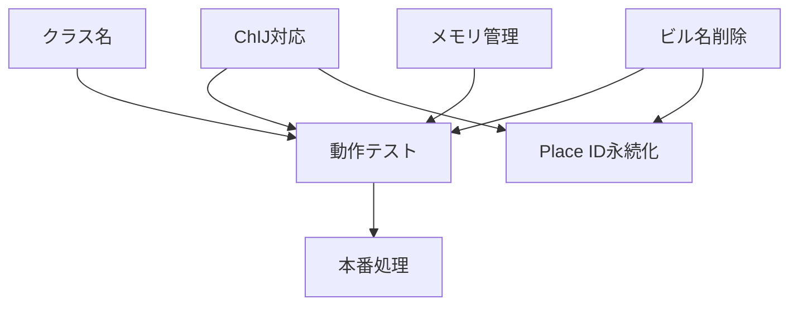

# 統合戦略 - シニアエンジニア視点での改訂版
作成日: 2025-08-16

## 前提認識の修正

### Place ID事前取得の罠
**初期案の問題点**：
- Place ID事前取得（P0）は、正確なPlace ID取得機能（P2）なしには無意味
- 不正確なPlace IDを32個集めても、ルート検索で失敗する
- **結論**: P0とP2は不可分

### キャッシュの存在を忘れていた
```python
# google_maps_scraper.py 既存実装
self.place_id_cache = {}  # メモリ内キャッシュ
self.route_cache = {}      # ルート結果キャッシュ
```
- **既にキャッシュ機能がある**
- 同一セッション内では重複取得しない
- Place ID事前取得の効果は限定的

## 真の優先順位（改訂版）

### Phase 1: 基盤整備【必須・即実施】
```
1. クラス名統一（単純作業）
2. Place ID精度向上（ChIJ + ビル名削除）
   - これなしにPlace ID関連の全機能が不安定
3. メモリ管理（9ルートごと再起動）
   - これなしに大規模処理が不可能
```

### Phase 2: 精度向上【Phase 1完了後】
```
4. 料金抽出改善（カンマ対応）
5. 時刻抽出の動作確認
   - v5で既に動作するはず
```

### Phase 3: 最適化【動作確認後】
```
6. Place ID永続化（JSONへの保存）
   - セッションを跨いだ再利用
7. バッチ処理の効率化
```

## 実装順序（最終版）

| 順序 | 作業 | 理由 | 依存関係 |
|------|------|------|----------|
| 1 | クラス名変更 | 基本的整合性、5分で完了 | なし |
| 2 | ChIJ形式対応 | 新Google Maps必須 | なし |
| 3 | ビル名削除処理 | Place ID精度に必須 | なし |
| 4 | 9ルート再起動 | メモリ安定性必須 | なし |
| 5 | 動作テスト | 基盤機能の確認 | 1-4 |
| 6 | 料金カンマ対応 | Nice to have | なし |
| 7 | Place ID永続化 | 最適化（後回し可） | 2,3 |

## なぜこの順序か

### 依存関係の解決


### リスク最小化
1. **独立した変更を先に**: 相互影響がない変更を並行実施
2. **テストで確認**: 基盤変更後、必ずテスト
3. **最適化は最後**: 動くものを先に作る

## コード変更の具体的内容

### 1. クラス名変更（1分）
```python
# google_maps_scraper.py
L38: class GoogleMapsScraperV5: → class GoogleMapsScraper:
L594: scraper = GoogleMapsScraperV5() → scraper = GoogleMapsScraper()
```

### 2. ChIJ形式対応（10分）
```python
# google_maps_scraper.py get_place_id()内
# L120の後に追加
# ChIJ形式を最優先で検索
chij_match = re.search(r'(ChIJ[a-zA-Z0-9\-\_\.]{23})', self.driver.page_source)
if chij_match:
    place_id = chij_match.group(1)
    logger.info(f"   ✅ Place ID取得（ChIJ形式）: {place_id}")
    # 既存の0x形式検索をスキップ
```

### 3. ビル名削除（10分）
```python
# google_maps_scraper.py normalize_address()の後
def simplify_address_for_place_id(self, normalized):
    """Place ID検索用に住所を簡略化"""
    simplified = normalized
    
    # ビル名パターンを削除
    building_patterns = [
        r'\s*\d+階.*$',
        r'\s*[B]?\d+[F].*$', 
        r'髙島屋.*$',
        r'三井ビルディング.*$',
        r'ルフォンプログレ.*$',
        r'La\s+Belle.*$',
    ]
    
    for pattern in building_patterns:
        simplified = re.sub(pattern, '', simplified, flags=re.IGNORECASE)
    
    return simplified.strip()
```

### 4. メモリ管理（1分）
```python
# google_maps_scraper.py L441
if self.route_count >= 30: → if self.route_count >= 9:
```

## Place ID永続化は本当に必要か？

### メリット
- セッション跨ぎでの再利用
- 初回起動時の時間短縮

### デメリット
- JSONファイルの管理複雑化
- Place ID変更時の不整合リスク
- 実装工数（1-2時間）

### 結論
**現時点では不要**。まず動くものを作り、必要に応じて後から追加。

## アクションプラン

### 今すぐ実施（30分）
1. ✅ クラス名変更
2. ✅ ChIJ対応追加
3. ✅ ビル名削除追加
4. ✅ 9ルート再起動
5. ✅ テスト実行

### テスト後実施（必要に応じて）
6. 料金カンマ対応
7. Place ID永続化（効果測定後）

## シニアエンジニアとしての判断

### やらないことを決める
- Place ID事前取得スクリプト → キャッシュで十分
- 複雑な最適化 → まず動かす
- improvedの駅名詳細 → 構造が違いすぎる

### 集中すること
- **確実に動く基盤機能**
- **既存機能の修正**
- **最小限の変更で最大の効果**

---

これが熟考の結果です。Place ID事前取得は罠でした。